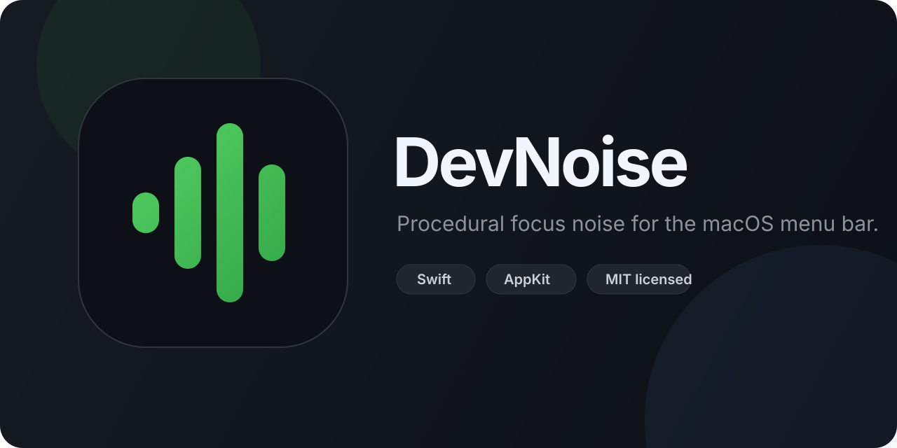

<div align="center">
  

  <p>
    <a href="https://github.com/Reece-Challinor/devnoise/actions/workflows/ci.yml"></a>
    <a href="https://github.com/Reece-Challinor/devnoise/releases/latest"></a>
    <a href="https://github.com/Reece-Challinor/devnoise/releases"></a>
    <a href="LICENSE"></a>
    <a href="https://www.linkedin.com/in/reecechallinor/"></a>
  </p>
</div>

DevNoise is a tiny, keyboard-first procedural noise app for the macOS menu bar. It has no windows, Dock icon, accounts, analytics, microphone access, or in-app network calls.

## Install

[Download the latest DMG](https://github.com/Reece-Challinor/devnoise/releases/latest/download/DevNoise.dmg), open it, and drag DevNoise to Applications. DevNoise requires macOS 13 or later and supports Apple silicon and Intel Macs.

To update an existing installation manually:

1. Quit DevNoise.
2. Download the newer DMG from [GitHub Releases](https://github.com/Reece-Challinor/devnoise/releases/latest).
3. Open the DMG.
4. Drag DevNoise into Applications.
5. Choose **Replace** when macOS asks.
6. Reopen the app.

Saved noise, depth, and volume preferences remain because the bundle identifier is unchanged. Playback and timers do not persist. DevNoise does not contain an automatic updater or perform an in-app version check.

## Controls

| Action | Shortcut |
| --- | --- |
| Play / Pause | <kbd>Control</kbd> <kbd>Command</kbd> <kbd>N</kbd> |
| Cycle Timer | <kbd>Control</kbd> <kbd>Command</kbd> <kbd>T</kbd> |
| Next Noise | <kbd>Control</kbd> <kbd>Command</kbd> <kbd>]</kbd> |
| Cycle Depth | <kbd>Control</kbd> <kbd>Command</kbd> <kbd>[</kbd> |
| Volume Up | <kbd>Control</kbd> <kbd>Command</kbd> <kbd>=</kbd> |
| Volume Down | <kbd>Control</kbd> <kbd>Command</kbd> <kbd>-</kbd> |

White, pink, brown, and green noise are generated locally. Normal, Deep, and Super Deep presets shape their tone. Noise, depth, and volume are saved; playback always launches stopped.

While noise is playing, the **Timer** menu can pause the current session after 15, 25, 45, or 60 minutes. The selected preset and a locale-formatted stop time appear in the menu. **Cycle Timer** advances through Off → 15 → 25 → 45 → 60 → Off; cycling to Off cancels the timer without pausing playback. The shortcut has no effect while playback is paused. Timers are session-only: every pause, reset, audio failure, output change, quit, or relaunch clears them.

If macOS changes the active audio output configuration during playback—for example, headphones disconnect or the system output changes—DevNoise stops immediately and shows **Audio stopped — output device changed**. It never automatically resumes or transfers the session to another output. Press **Play Noise** explicitly to clear the message, rebuild the audio graph if needed, and start through the current device.

The menu footer displays the version embedded in the app and provides fixed links to the latest GitHub Release and Reece's LinkedIn profile. Links open in the default browser only after a click; DevNoise itself makes no network request and does not check for updates.

## Build

You need macOS 13+ and Xcode. There are no third-party dependencies.

```bash
git clone https://github.com/Reece-Challinor/devnoise.git
cd devnoise
make test
make build
```

Run `make` to see every build, DMG, verification, and release command.

## Contributing

DevNoise is intentionally small. Fork the repository, create a focused branch, and open a pull request.

DevNoise is a small open-source learning project. Maintenance and future updates are provided on a best-effort basis.

1. Read [AGENTS.md](AGENTS.md) before changing runtime behavior.
2. Preserve the menu-bar-only, silent, local-first product contract.
3. Use Apple frameworks; do not add dependencies.
4. Add or update tests with code changes.
5. Run `make verify`.

Keep public Swift APIs documented with `///` comments. Every Swift source file starts with a one-line purpose and `SPDX-License-Identifier: MIT`. Contributions are licensed under the repository's MIT License.

<details>
<summary><strong>Architecture</strong></summary>

DevNoise is one AppKit process with seven production Swift files and no external packages.

```text
AppDelegate
├── StatusBarController ── menu commands ──┐
├── HotkeyManager ─────── global commands ├── AppModel
├── SettingsStore ─────── allowed defaults┘      │
├── SessionTimer ───────── one-shot session stop ┤
└── AudioEngineManager ◀── procedural settings ──┘
```

- `AppDelegate.swift` starts the accessory app, installs the status item first, and wires dependencies.
- `AppModel.swift` owns value state and command transitions.
- `StatusBarController.swift` renders the AppKit menu and native template icon.
- `SessionTimer.swift` schedules one transient, generation-guarded stop for the active session.
- `SettingsStore.swift` persists only noise, depth, and volume.
- `HotkeyManager.swift` registers six fixed Carbon hotkeys without accessibility permission.
- `AudioEngineManager.swift` lazily owns `AVAudioEngine`, stops on output configuration changes, and generates samples in its render callback.

The render callback uses precomputed scalar state. It must not allocate, lock, block, perform I/O, or call Objective-C APIs. Playback is never persisted.

</details>

<a id="manual-qa"></a>
<details>
<summary><strong>Manual QA</strong></summary>

Before a release, verify on Apple silicon and Intel where possible:

- Launch the app and confirm it is silent.
- Confirm no Dock icon or app window appears.
- Play and pause audio; listen for clicks or abrupt artifacts.
- Rapidly perform Pause → Play and verify the new session continues.
- Change volume while playing and listen for smooth ramping.
- Change noise and depth while playing and listen for smooth transitions.
- Set each timer preset and verify its checkmark and stop-time row.
- Replace one active timer with another.
- Use Cycle Timer and verify Off → 15 → 25 → 45 → 60 → Off in order.
- While paused, use Cycle Timer and verify it does not start playback or a timer.
- Select **Off** and verify playback continues.
- Verify manual Pause, Reset, and quit clear the timer.
- Exercise timer expiry using the deterministic tests; do not shorten the production preset durations.
- Disconnect AirPods or Bluetooth headphones while playing.
- Unplug wired headphones while playing, if hardware is available.
- Change the macOS output device while playing.
- Confirm each detected device change stops immediately.
- Confirm audio never transfers unexpectedly to speakers.
- Reconnect the original headphones and confirm there is no automatic resume.
- Explicitly press Play and confirm playback works through the current device.
- Confirm the transient device-change message clears after explicit Play.
- Confirm the Version row matches the built application version.
- Click both footer links and verify they open the correct browser pages.
- Confirm no in-app network request or automatic update check occurs.
- Relaunch and confirm noise, depth, and volume persist while playback and timer state do not.
- Recheck all six fixed hotkeys, including Play / Pause and Cycle Timer.
- The signed DMG installs by drag-and-drop and opens without a Gatekeeper warning.

</details>

<details>
<summary><strong>Maintainer release guide</strong></summary>

GitHub Actions builds an existing `v*` tag, tests the app, signs and notarizes it, staples the ticket, verifies Gatekeeper, writes a SHA-256 sidecar, attests provenance, and publishes the GitHub Release. Never publish an unsigned DMG as an official release.

Add these Actions secrets once:

| Secret | Value |
| --- | --- |
| `DEVNOISE_SIGN_IDENTITY` | Full `Developer ID Application: … (TEAMID)` identity |
| `DEVNOISE_CERTIFICATE_P12_BASE64` | Base64-encoded Developer ID `.p12` |
| `DEVNOISE_CERTIFICATE_P12_PASSWORD` | `.p12` export password |
| `DEVNOISE_NOTARY_KEY_P8_BASE64` | Base64-encoded App Store Connect API `.p8` key |
| `DEVNOISE_NOTARY_KEY_ID` | API key ID |
| `DEVNOISE_NOTARY_ISSUER_ID` | API issuer ID |

On macOS, encode the credential files without line wrapping:

```bash
base64 -i DeveloperID.p12 | pbcopy
base64 -i AuthKey_ABC123.p8 | pbcopy
```

For version `1.0.0`, set `MARKETING_VERSION`, run `make verify`, complete the manual QA checklist above, then push an annotated tag:

```bash
git tag -a v1.0.0 -m "DevNoise 1.0.0"
git push origin v1.0.0
```

The Release workflow publishes `DevNoise.dmg` and `DevNoise.dmg.sha256`. If an existing tag needs another run, use **Actions → Release → Run workflow** and enter the tag.

</details>

## Security

Do not open a public issue for a vulnerability. [Report it privately](https://github.com/Reece-Challinor/devnoise/security/advisories/new) with the affected version, reproduction steps, impact, and any suggested mitigation. Only the latest release is supported.

## Project

- [Releases and version history](https://github.com/Reece-Challinor/devnoise/releases)
- [Stable DMG download](https://github.com/Reece-Challinor/devnoise/releases/latest/download/DevNoise.dmg)
- [Portfolio site](https://reece-challinor.github.io/devnoise/)

MIT licensed. Built by [Reece Challinor](https://www.linkedin.com/in/reecechallinor/).
